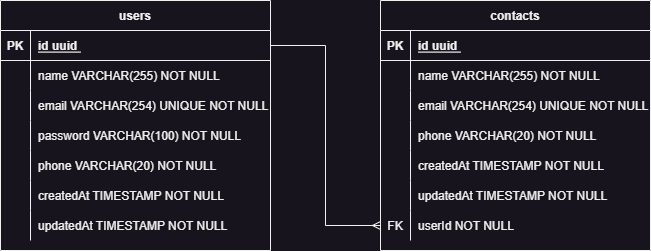

<h1 align="center">
  client-connect-api
</h1>

  This is the backend for the ClientConnect application, a platform designed to efficiently manage your contacts. It has been developed using Node.js, Express, TypeORM, and PostgreSQL. The API offers a range of endpoints that allow you to perform various operations and effectively manage your contacts.

<h2 id="top">Table of Contents</h2>

<ol>
  <li><a href="#1-overview">Overview</a></li>
  <li><a href="#2-er-diagram">ER Diagram</a></li>
  <li><a href="#3-quick-start">Quick Start</a>
    <ol>
      <li><a href="#31-installing-dependencies">Installing Dependencies</a></li>
      <li><a href="#32-environment-variables">Environment Variables</a></li>
      <li><a href="#33-migrations">Migrations</a></li>
      <li><a href="#34-running-the-api">Running the API</a></li>
    </ol>
  </li>
  <li><a href="#4-api-documentation">API Documentation</a></li>
  <li><a href="#5-api-structure">API Structure</a></li>
</ol>

<h2 id="1-overview">Overview</h2>

  The project was developed entirely in TypeScript, using Node.js as the runtime environment, and Express as the chosen framework. Data serialization for requests was handled using the Zod library, while the PostgreSQL relational database was used for data storage, managed by TypeORM.

  Here are the links for more information about the technologies used:

<ul>
  <li><a href="https://nodejs.org/en/">Node.js</a></li>
  <li><a href="https://expressjs.com/">Express</a></li>
  <li><a href="https://www.typescriptlang.org/">TypeScript</a></li>
  <li><a href="https://www.postgresql.org/">PostgreSQL</a></li>
  <li><a href="https://typeorm.io/">TypeORM</a></li>
  <li><a href="https://zod.dev/">Zod</a></li>
</ul>

<h2 id="2-er-diagram">ER Diagram</h2>

  ER diagram of the API defining the relationships between database tables.

  

<h2 id="3-quick-start">Quick Start</h2>

<a href="#top">Back to Top</a>

<h3 id="31-installing-dependencies">3.1. Installing Dependencies</h3>

  Clone the project to your machine and install the dependencies using the command:

<pre><code>yarn
</code></pre>

  Using npm:

<pre><code>npm install
</code></pre>

<h3 id="32-environment-variables">3.2. Environment Variables</h3>

  Next, create a <strong>.env</strong> file by copying the format from the <strong>.env.example</strong> file:

<pre><code>cp .env.example .env
</code></pre>

  Configure your environment variables with your Postgres credentials.

<h3 id="33-migrations">3.3. Migrations</h3>

  Run the migrations using the command:

<pre><code>yarn run typeorm migration:run -- -d ./src/data-source
</code></pre>

<h3 id="34-running-the-api">3.4. Running the API</h3>

  To run the API locally, use the command:

<pre><code>yarn run dev
</code></pre>

  Below are the commands for building the project:

<pre><code>yarn run build
yarn typeorm migration:run -d dist/data-source
yarn run start
</code></pre>

<h2 id="4-api-documentation">API Documentation</h2>

<a href="#top">Back to Top</a>

  You can access the API documentation created with Swagger using the endpoint /api-docs/. This documentation describes the resources that the API possesses, such as endpoints, request examples, response examples, and authentication methods.
  You can also access the API documentation through the following links:

<ul>
  <li><a href="https://clientconnect-api.onrender.com/api-docs">Contacts-Book-Production-Documentation</a></li>
  <li><a href="https://app.swaggerhub.com/apis-docs/eduschwert/clientconnect-api/1.0.0">Contacts-Book-Swagger-Site-Documentation</a></li>
</ul>

  To import the workspace into Insomnia:

<h2 id="5-api-structure">API Structure</h2>

<a href="#top">Back to Top</a>

<h3>Index</h3>

<ul>
  <li><a href="#1-users">Users</a></li>
  <li><a href="#2-contacts">Contacts</a></li>
</ul>

<h3 id="1-users">1. Users</h3>

<a href="#5-api-structure">Back to API Structure</a>

  The User object is defined as:

<table>
  <thead>
    <tr>
      <th>Field</th>
      <th>Type</th>
      <th>Description</th>
    </tr>
  </thead>
  <tbody>
    <tr>
      <td>id</td>
      <td>UUID</td>
      <td>Unique identifier of the user</td>
    </tr>
    <tr>
      <td>name</td>
      <td>string</td>
      <td>The name of the user</td>
    </tr>
    <tr>
      <td>email</td>
      <td>string</td>
      <td>The email of the user</td>
    </tr>
    <tr>
      <td>phone</td>
      <td>string</td>
      <td>The phone number of the user</td>
    </tr>
    <tr>
      <td>password</td>
      <td>string</td>
      <td>The user's access password</td>
    </tr>
    <tr>
      <td>createdAt</td>
      <td>string</td>
      <td>The user's registration date</td>
    </tr>
    <tr>
      <td>updatedAt</td>
      <td>string</td>
      <td>The date of the user's last update</td>
    </tr>
  </tbody>
</table>

<h4>Endpoints</h4>

<table>
  <thead>
    <tr>
      <th>Method</th>
      <th>Route</th>
      <th>Description</th>
    </tr>
  </thead>
  <tbody>
    <tr>
      <td>POST</td>
      <td>/users</td>
      <td>Create a user</td>
    </tr>
    <tr>
      <td>GET</td>
      <td>/users/</td>
      <td>List logged-in user data</td>
    </tr>
    <tr>
      <td>PATCH</td>
      <td>/users/</td>
      <td>Update user data</td>
    </tr>
    <tr>
      <td>DELETE</td>
      <td>/users/</td>
      <td>Delete a user</td>
    </tr>
    <tr>
      <td>GET</td>
      <td>/users/contacts</td>
      <td>List contacts of logged-in user</td>
    </tr>
    <tr>
      <td>POST</td>
      <td>/login</td>
      <td>Login with a user</td>
    </tr>
  </tbody>
</table>

<h3 id="2-contacts">2. Contacts</h3>

<a href="#5-api-structure">Back to API Structure</a>

  The Contact object is defined as:

<table>
  <thead>
    <tr>
      <th>Field</th>
      <th>Type</th>
      <th>Description</th>
    </tr>
  </thead>
  <tbody>
    <tr>
      <td>id</td>
      <td>UUID</td>
      <td>Unique identifier of the contact</td>
    </tr>
    <tr>
      <td>name</td>
      <td>string</td>
      <td>The name of the contact</td>
    </tr>
    <tr>
      <td>email</td>
      <td>string</td>
      <td>The email of the contact</td>
    </tr>
    <tr>
      <td>phone</td>
      <td>string</td>
      <td>The phone number of the contact</td>
    </tr>
    <tr>
      <td>createdAt</td>
      <td>string</td>
      <td>The contact's registration date</td>
    </tr>
    <tr>
      <td>updatedAt</td>
      <td>string</td>
      <td>The date of the contact's last update</td>
    </tr>
  </tbody>
</table>

<h4>Endpoints</h4>

<table>
  <thead>
    <tr>
      <th>Method</th>
      <th>Route</th>
      <th>Description</th>
    </tr>
  </thead>
  <tbody>
    <tr>
      <td>POST</td>
      <td>/contacts</td>
      <td>Create a contact</td>
    </tr>
    <tr>
      <td>GET</td>
      <td>/contacts/:contactId</td>
      <td>Get contact data by ID</td>
    </tr>
    <tr>
      <td>PATCH</td>
      <td>/contacts/:contactId</td>
      <td>Update contact data by ID</td>
    </tr>
    <tr>
      <td>DELETE</td>
      <td>/contacts/:contactId</td>
      <td>Delete a contact by ID</td>
    </tr>
  </tbody>
</table>

<h4>Author</h4>

  This project was developed by <a href="https://github.com/eduschwert">Eduardo Schwert</a>.

